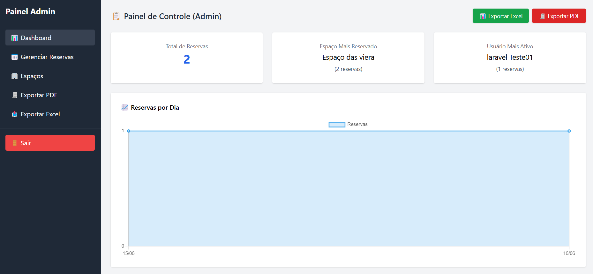

# 📅 Sistema de Reservas - Laravel

Este projeto é um sistema completo de **gestão de reservas de espaços** desenvolvido em Laravel 10, com autenticação, painel administrativo, exportação de dados e controle de permissões de acesso.

---

## ✨ Funcionalidades Implementadas

### 🔐 Autenticação e Controle de Acesso
- Cadastro, login, logout e verificação de e-mail.
- Middleware customizado para **controle de acesso de administradores**.

### 📅 Reservas de Espaços
- CRUD completo de reservas com validações de horário, data e conflito.
- Cada reserva está vinculada a um espaço e a um usuário.

### 🏢 Gerenciamento de Espaços
- Somente administradores podem criar, editar ou excluir espaços disponíveis.
- Tela dedicada para cadastro e edição.

### 📊 Painel Administrativo
- Estatísticas com **total de reservas**, **espaço mais reservado**, **usuário mais ativo**.
- Gráfico dinâmico com Chart.js mostrando as reservas por dia.

### 📄 Exportações de Dados
- Exportação em **PDF** e **Excel** das reservas cadastradas.

### 🔎 Filtros Dinâmicos
- Filtragem por usuário, espaço e data diretamente no painel admin.

### 📱 Design Responsivo
- Utilização de Tailwind CSS.
- Layout administrativo com sidebar responsiva.

---

## 🧠 Tecnologias Utilizadas

- Laravel 10.x
- Tailwind CSS
- Chart.js
- Laravel Excel (maatwebsite)
- DomPDF (barryvdh)
- MySQL / MariaDB
- Blade Components e Layouts
- Vite (build de assets frontend)

---

## 🚀 Como rodar localmente

### 1. Clone o repositório e instale dependências PHP
```bash
git clone https://github.com/seuusuario/sistema-reservas.git
cd sistema-reservas
composer install
```

### 2. Configure o ambiente
```bash
cp .env.example .env
php artisan key:generate
```

### 3. Configure o banco de dados no `.env` e execute as migrations
```bash
php artisan migrate --seed
```

### 4. Instale dependências frontend e rode o Vite
```bash
npm install
npm run dev
```

Você verá algo como:

```
  VITE v6.3.5  ready in 454 ms

  ➜  Local:   http://localhost:5173/
  ➜  press h + enter to show help
```

### 5. Inicie o servidor Laravel
```bash
php artisan serve
```

Acesse o sistema em `http://127.0.0.1:8000`

---

## 🖼️ Painel Administrativo



---

## 🗺️ Próximos Passos (Roadmap)

| Prioridade | Tarefa |
|------------|--------|
| 🔜 Alta     | Criar plano de assinatura mensal por espaço (com Stripe ou PagSeguro) |
| 🔜 Média    | Permitir usuários gerenciarem seus próprios espaços e reservas |
| 🔜 Média    | Sistema de notificações por e-mail para confirmações de reservas |
| 🔜 Média    | Melhorar filtros com intervalo de datas e status de reserva |
| 🔜 Baixa    | Implementar painel financeiro para o admin com resumo das assinaturas |
| 🔜 Baixa    | Criar versão mobile dedicada usando Laravel API + Flutter/React Native |
| 🔜 Extra    | Testes automatizados com PHPUnit e Laravel Dusk |

---

## 👨‍💻 Autor

Desenvolvido por José Tayllan Pinto Almeida, focado em consolidar habilidades em desenvolvimento de softwares, banco de dados relacional e UI com Tailwind.

---

## 📢 Licença

Este projeto está licenciado sob a [MIT License](LICENSE).
<p align="center"><a href="https://laravel.com" target="_blank"></a></p>

<p align="center">
<a href="https://github.com/laravel/framework/actions"></a>
<a href="https://packagist.org/packages/laravel/framework"></a>
<a href="https://packagist.org/packages/laravel/framework"></a>
<a href="https://packagist.org/packages/laravel/framework"></a>
</p>

## About Laravel

Laravel is a web application framework with expressive, elegant syntax. We believe development must be an enjoyable and creative experience to be truly fulfilling. Laravel takes the pain out of development by easing common tasks used in many web projects, such as:

- [Simple, fast routing engine](https://laravel.com/docs/routing).
- [Powerful dependency injection container](https://laravel.com/docs/container).
- Multiple back-ends for [session](https://laravel.com/docs/session) and [cache](https://laravel.com/docs/cache) storage.
- Expressive, intuitive [database ORM](https://laravel.com/docs/eloquent).
- Database agnostic [schema migrations](https://laravel.com/docs/migrations).
- [Robust background job processing](https://laravel.com/docs/queues).
- [Real-time event broadcasting](https://laravel.com/docs/broadcasting).

Laravel is accessible, powerful, and provides tools required for large, robust applications.

## Learning Laravel

Laravel has the most extensive and thorough [documentation](https://laravel.com/docs) and video tutorial library of all modern web application frameworks, making it a breeze to get started with the framework.

You may also try the [Laravel Bootcamp](https://bootcamp.laravel.com), where you will be guided through building a modern Laravel application from scratch.

If you don't feel like reading, [Laracasts](https://laracasts.com) can help. Laracasts contains thousands of video tutorials on a range of topics including Laravel, modern PHP, unit testing, and JavaScript. Boost your skills by digging into our comprehensive video library.

## Laravel Sponsors

We would like to extend our thanks to the following sponsors for funding Laravel development. If you are interested in becoming a sponsor, please visit the [Laravel Partners program](https://partners.laravel.com).

### Premium Partners

- **[Vehikl](https://vehikl.com)**
- **[Tighten Co.](https://tighten.co)**
- **[Kirschbaum Development Group](https://kirschbaumdevelopment.com)**
- **[64 Robots](https://64robots.com)**
- **[Curotec](https://www.curotec.com/services/technologies/laravel)**
- **[DevSquad](https://devsquad.com/hire-laravel-developers)**
- **[Redberry](https://redberry.international/laravel-development)**
- **[Active Logic](https://activelogic.com)**

## Contributing

Thank you for considering contributing to the Laravel framework! The contribution guide can be found in the [Laravel documentation](https://laravel.com/docs/contributions).

## Code of Conduct

In order to ensure that the Laravel community is welcoming to all, please review and abide by the [Code of Conduct](https://laravel.com/docs/contributions#code-of-conduct).

## Security Vulnerabilities

If you discover a security vulnerability within Laravel, please send an e-mail to Taylor Otwell via [taylor@laravel.com](mailto:taylor@laravel.com). All security vulnerabilities will be promptly addressed.

## License

The Laravel framework is open-sourced software licensed under the [MIT license](https://opensource.org/licenses/MIT).


